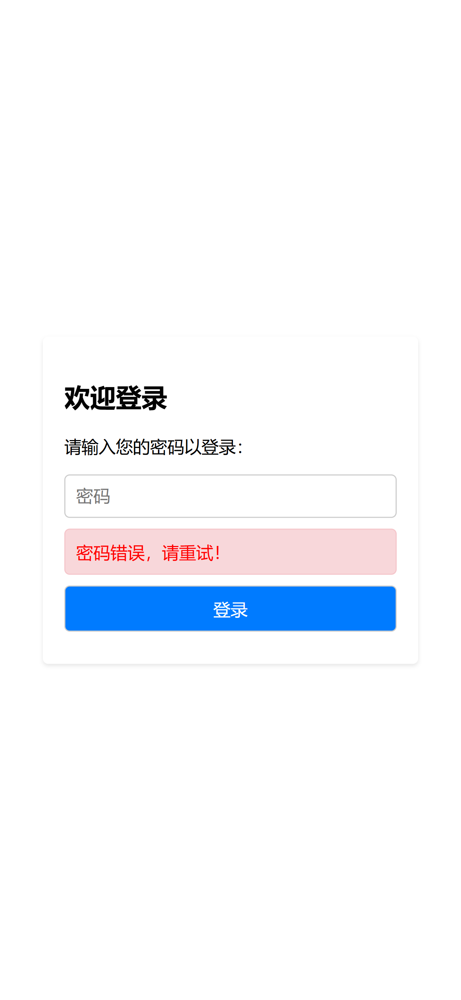
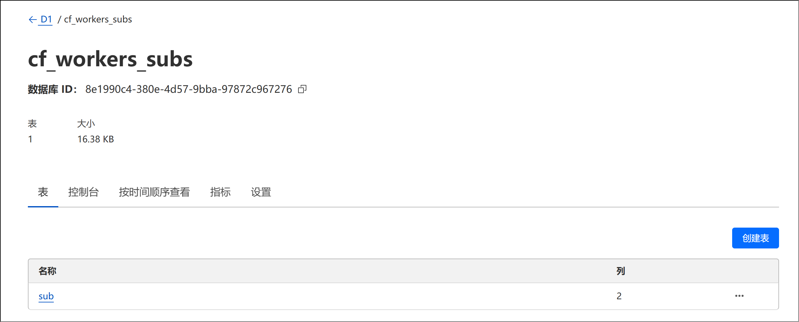

# Cf_Workers_Subs

### 借助 Cloudflare Workers 搭建，管理多个订阅，并生成一个订阅地址

## 预览
| 登录 | 首页 |
|------|------|
|  |  |

### 订阅链接地址
```
https://your.worker.dev/SECRET_PASSWORD
```
## 部署方法
> 目前仅尝试过wrangler部署

### 1. 创建D1数据库


### 2. 创建表


### 3. 记录D1数据库的ID


### 4. Clone本项目

```bash
git clone --depth=1 https://github.com/bestruirui/Cf_Workers_Subs.git
```
### 5. 修改wrangler.toml

修改为对应的database_id
```
[[d1_databases]]
binding = "MY_D1_DATABASE"
database_id = ""     # 第三步获取到的ID
database_name = "subs"
```

### 8. 修改worker.js

将下面的地址改为你的worker地址

```js
let SUB_CONFIG = 'https://your.worker.dev/config.ini';
```
将下面的密码改为你的自定义密码
```js
let SECRET_PASSWORD = 'yourpassword';
```
### 7. 部署
```bash
npm run deploy
```

